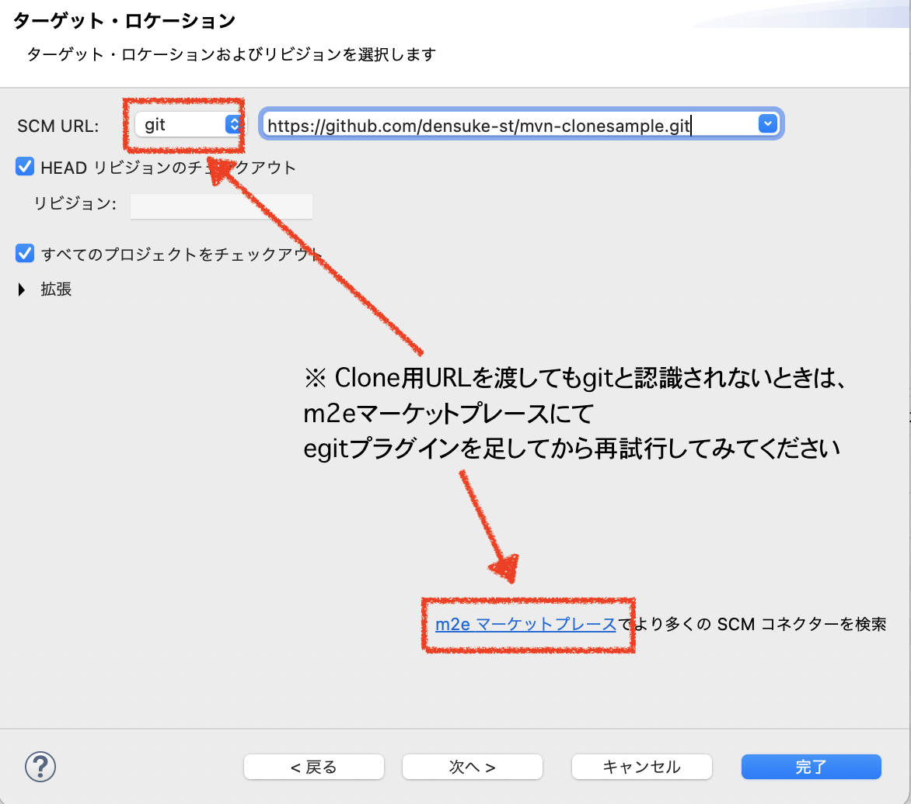

.. _lv1-clone:

=========================================
他の人のソースを取得する
=========================================

`GitHub <https://github.io>`_ 等のリポジトリサイトから、任意の公開リポジトリを引っ張ってこれるようになりましょう。
グループ開発などでリポジトリを共有するときなどに真っ先にこれが必要になります。

1. 取得元を確認する
2. cloneを行う

取得元を確認する
============================

取得元に関しては、大雑把に2つのケースがあります。

- プロジェクトサイトを教えてもらい、そこから取得
- clone用のURLを直接教えてもらう

プロジェクトサイトがGithubなどのコード公開用のサイトであれば、その中から確認できます。
サンプルとして、Hello World集的なものをちょっと作ってます。

- `densuke-st/hello-world <https://github.com/densuke-st/hello-world>`_

    densuke-st/hello-world

Githubの場合は、コード取得として緑色の :guilabel:`Code` 部分から、取得が可能です。

.. figure:: images/02-click-code.png

    Codeボタンを押したとき

通常は "HTTPS" タブで確認できるURLを使うと良いでしょう。

.. note::

    GitHub CLI(:command:`gh` コマンド)をインストールした場合、コマンドラインから少しだけ楽に操作できます。
    詳しくは `GitHub CLI <https://cli.github.com/>`_ を参照してください。

cloneを行う
====================

取得元URLが確認できたら、cloneを行います。
clone操作は指定されたURLに存在する「リポジトリ」のクローンをローカルに作成する操作です。

コマンドラインで行う
------------------------------

コマンドラインから行う場合、対象となるディレクトリにて :command:`git` を実行します。
ここでは `densuke-st/hello-world <https://github.com/densuke-st/hello-world>`_ のclone URLを用いて行います。

.. code-block:: console
    :caption: git clone処理

    # Linux/macOS
    $ git clone https://github.com/densuke-st/hello-world.git

    # Windows(PowerShell)
    PS> git clone https://github.com/densuke-st/hello-world.git

    git cloneによるコード取得

.. warning::

    この作業により、ディレクトリ :file:`hello-world` ができあがります。
    既にこのディレクトリが存在している場合は失敗します。
    既存のディレクトリを削除するか、名前を変えるなどの対策が必要です。

    .. code-block:: console

        $ git clone https://github.com/densuke-st/hello-world.git
        fatal: destination path 'hello-world' already exists and is not an empty directory.

あとはできあがったディレクトリの中を好きに探索してください。
なお、 `densuke-st/hello-world <https://github.com/densuke-st/hello-world>`_ の :file:`Java/Maven` ディレクトリはEclipseにてインポート可能にしてます。

このように、取得用URLがわかれば、自分の手元にコードのコピーを持つことが可能です。

vscodeで行う
----------------------

.. todo:: vscodeの作業について書いておく

Eclipseで行う
---------------------

Eclipseで他の方のリポジトリをcloneする場合、プロジェクトのインポートを使って行います。
ただし、状況として、以下のものを考えておく必要があります。

Eclipseプロジェクトのgit共有
    Eclipseのプロジェクトをgitにそのまま上げてしまう状況です。素直にインポートできますが、ライブラリ環境の設定などが同一になっていないと機能しないため、実際はそれほど使われません。
Mavenなどの開発ツールを使った共有
    プロジェクトの構造をMavenなどの開発ツールで構成した状態でgitによる共有をおこなっています。中で必要な情報は論理的に設定しており、必要なライブラリなども記述されているため、取得後に該当するライブラリを自動的に構成して同期できます。
    現実的な開発ではこのスタイルが基本です。
    ただしEclipseで使う場合は、歴史的経緯から「SVNからインポート」の扱いになります(後述)

Eclipseプロジェクト自体をgitで共有している場合は、インポート設定にて :guilabel:`Git --> Gitからプロジェクト` となります。
スマートプロジェクト側にしておくと「よしなに」やってくれるので、慣れない間はこちらが楽だと思います。

.. figure:: images/22-import-from-github-eclipse.png

    EclipseからGit上のEclipseプロジェクトを指定する

続いての取得方法はURIを指定する形で進めてください。

    インポート元の指定

クローン用のURLを取得し、渡しましょう。
ここでは、 `densuke-st/eclipse-clonesample <https://github.com/densuke-st/eclipse-clonesample>`_ から取得して行ってみます。

    プロジェクトのクローン用URLを貼り付け

URLを貼り付けることで、必要項目のほとんどは自動的に補完されます。
ユーザー名・パスワードは空のままでも取得するだけなら問題ありませんので記入不要です。

URLが認識され、リポジトリにアクセスされると、ブランチというものを確認してきますが、特に今はいじる必要ありません。

.. figure:: images/25-select-branch-eclipse.png

    ブランチの指定(そのままで良い)

gitでは **ブランチ** という概念で並行した開発が行えます。各ブランチごとに名前が付いているのですが、デフォルトのブランチ名は現在 `main` となっている [#mainbranch]_ ので、こちらを指定するのが一般的です。

ローカルブランチの設定はクローン元に基本的に準じますので、通常はいじる要素はありません、そのまま進めます。

.. figure:: images/26-set-local-eclipse.png

    ローカルブランチの設定

取得後、コード中に含まれる設定を読み取ってEclipseプロジェクトを検出することで、プロジェクトの設定にそのまま進みます。

    プロジェクトのインポート

完了することで、プロジェクトのインポート処理が完了し、編集可能になります。

Mavenプロジェクトなどの場合
--------------------------------------------

`Maven <https://maven.apache.org/>`_ や `Gradle <https://gradle.org/>`_ など、ビルドを管理するフレームワークを使っている場合、
Eclipseプロジェクトと異なり、(設定次第ですが)論理的な設定を元に必要なライブラリ情報などを取り込んで動かせます

ただしEclipseのプロジェクトではないため、内部的にEclipseプロジェクトとして見せるためのプラグインというものを通すことで、透過的に扱えるようになっています。

- Mavenの利用であれば `M2Eclipse <https://www.eclipse.org/m2e/>`_ をインストール
    - 学校配布のEclipseでは標準で組み込んでいます
    - ただしGit経由で取り込むための機能が入っていないため、SCMの追加(:menuselection:`インポート --> SVNからMavenプロジェクトをインポート --> m2eマーケットプレース` でegitプラグインを足す必要があります
        .. figure:: images/31-scmplugin-eclipse.png

            m2e用のプラグイン追加マーケットプレース
- Gradleの利用であれば、マーケットプレース(:menuselection:`ヘルプ --> Eclipseマーケットプレース`) にてGradle向けのプラグインを検索して入れることができます。ただ私はEclipseにてはGradleを使っていないので各自で調べてください

インポート時に  :menuselection:`インポート --> SVNからMavenプロジェクトをチェックアウト` で進めてもらうと、Gitのクローン用URLを渡すことでMavenプロジェクトを取り込めます。

.. figure:: images/28-checkout-mvn-eclipse.png

    SVNからMavenプロジェクトをチェックアウト ※SVNだけど気にしない

    Clone用のURLを渡す

あとは指示に従うことでEclipseプロジェクトをインポートし、ライブラリ類を裏で取得して利用可能になります。

zipと何が違うの?
===========================

これだけだと :guilabel:`Code` にてzipファイルを落としたのと変わらないと思います。
でも実は大きく違います。

- 履歴が見られます(:command:`git log`)
    .. figure:: images/04-git-log.png

- 誰かが更新したときに、更新分を取得可能です(pullの挙動は後ほど入ります)
     .. code-block:: console
        :caption: コードの更新(git pull)

        $ git pull
        remote: Enumerating objects: 21, done.
        remote: Counting objects: 100% (21/21), done.
        remote: Compressing objects: 100% (3/3), done.
        remote: Total 11 (delta 2), reused 11 (delta 2), pack-reused 0
        Unpacking objects: 100% (11/11), 809 bytes | 101.00 KiB/s, done.
        From https://github.com/densuke-st/hello-world
        dcd3b13..826094c  development -> origin/development
        Updating dcd3b13..826094c
        Fast-forward
        Java/Maven/helloworld/src/main/java/jp/example/App.java | 2 +-
        1 file changed, 1 insertion(+), 1 deletion(-)

.. rubric:: Footnotes

.. [#mainbranch] 一昔前だと `master` 一択だったのですが、諸事情により主系統ブランチの設定が変更されています。ただしすべて `main` であるわけでもなく、 `development` など多少のばらつきがあります。どのブランチが主系統になるかは開発者に確認すると良いでしょう。
