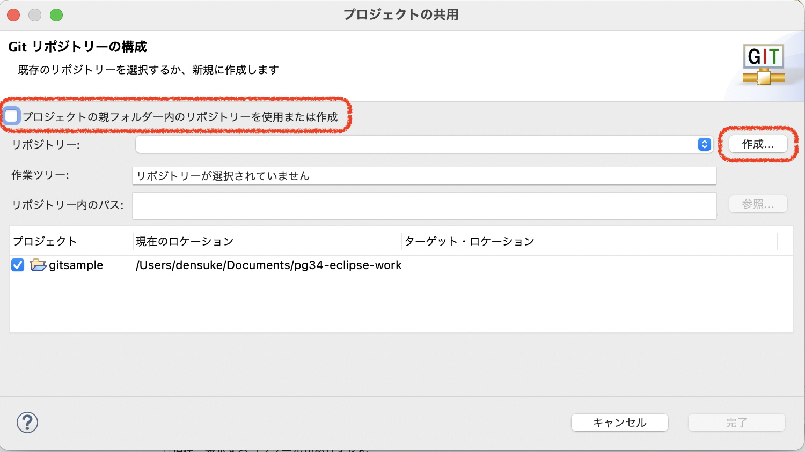

.. _lv1-init:

===================================
新規にリポジトリを作る
===================================

適当なディレクトリを用意して、ローカルのリポジトリを作ってみましょう。

1. :file:`my-hello-world` ディレクトリを作り、その中で端末を開きます
2. :command:`git init` コマンドでリポジトリを生成します

.. code-block:: console
    :caption: リポジトリの作成(ローカル)

    # プロンプトはUNIX向けですが、PowerShellでも同じ操作ができます
    $ mkdir my-hello-world
    $ cd my-hello-world
    $ git init
    Initialized empty Git repository in /private/tmp/my-hello-world/.git/

このとき、initしたディレクトリにおいて、 :file:`.git` というディレクトリが作られます(UNIX環境であればドットファイルのため通常は見えない)。
このディレクトリの中は大きく2つの領域として使われ、全体として **リポジトリ** と呼ばれます。

.. figure:: images/repo-local-00.png

    init直後の状態

:file:`.git` 自体をリポジトリと一般的に呼びますが…

リポジトリ域(狭義での「リポジトリ」)
    コミットと呼ばれる変更不可のデータを納める領域、ローカルでコミットしているものもありますし、リモートから入ってくるものもあります。
    各コミットは親コミットとのリンクを持ちます、
ステージ(キャッシュ)
    コミットされる前の状態(ファイル群)が納められる領域、コミット後もコピーを(論理的に)持って差分抽出の補助も行います。

そしてディレクトリそのものは **ワークツリー** と呼びます。

次は、ファイルを配置してリポジトリに登録してみましょう。

vscodeにおけるinit
============================

Visual Studio Code(vscode)上でのgitの利用については2通り考えられます。

-  :command:`git` で作ったディレクトリ(リポジトリ・ワークツリーを開く
- vscode自身で作る

:command:`git` で作成したディレクトリを開く
------------------------------------------------------

ディレクトリ(フォルダー)を開けばgit機能が有効な状態となります。

.. code-block:: console
    :caption: コマンドラインから開く例

    $ ls -a
    .    ..    .git    sample1.py # .gitがあるのでリポジトリ込み状態
    $ code . # カレントディレクトリをvscodeで開く

    vscodeでgitリポジトリのディレクトリを開いた場合

:file:`.git` ディレクトリが認識されると、現在のブランチ名が下部ステータス部に追加されます。
また、gitリポジトリかどうかにかかわらず、左にgitによる履歴管理のボタンが用意されています。

vscodeの中で初期化する
----------------------------

新規に作ったディレクトリにおいて、vscodeにてリポジトリの生成(:command:`git init` 相当)も可能です。

.. figure:: images/06-new-dir-vscode.png

    新規に作ったばかりのディレクトリ、リポジトリを含まないのでステータスに出ていない

リポジトリを生成するには、ソース管理用のアイコンから作成(初期化)が可能です。

    初期化を指示する

もちろんコマンドパレットからも初期化の指示は可能です。

.. figure:: images/08-git-init-palette.png

    初期化を指示する(コマンドパレットから)

こちらは対象のディレクトリの確認が出る(候補として開いているディレクトリが入っている)ので、そのまま選択すれば初期化処理が終わります。

Eclipseの中で初期化する
===================================

Eclipseの場合、少々勝手が異なります。

新規にプロジェクトを作成するとき、最初からgitを組み込むということはできないようです。
一度新規プロジェクトを生成してから「チーム」にて設定をすることになります。

ここではまず、gitsampleプロジェクト(Java)を作った状態とします。特に細かい設定はないので途中画面は省略します。

.. figure:: images/14-newproject-eclipse.png

    Eclipseで新規プロジェクトを作った状態

このプロジェクトをgitで管理したい場合、プロジェクトのコンテキストメニューより、  :menuselection:`チーム --> プロジェクトの共用` へ進みます。

    プロジェクトの共用

リポジトリーを作成しないと先へ進めない(:guilabel:`完了` がグレー状態)仕組みになっています。
ということでリポジトリーを作る必要があります。
実はEclipseでは2つの方法が用意されています。

    プロジェクトの共用画面

- :guilabel:`プロジェクトの親フォルダー内のリポジトリーを使用または作成` のチェックを使う
- 別の場所に用意されるリポジトリ専用エリア(ディレクトリ)にリポジトリを作ってプロジェクトを用意(:guilabel:`作成` ボタンから設定)

「プロジェクトの親フォルダー内のリポジトリーを使用または作成」 のチェックを使う
------------------------------------------------------------------------------------------------

一般的なgitを用いた共有であれば、このチェックを使うと楽に行えます。
この場合、プロジェクトのディレクトリの中に :file:`.git` ディレクトリを作成し、リポジトリ構造をディレクトリ内で内包するスタイルとなります。
構造上、ここまでの話のものと同じになります。

.. figure:: images/repo-local-00.png

    init直後の状態(再掲)

ただ、Eclipseではプロジェクトを作っては消すような行為が案外多く、その際に「ストレージから除去」するとリポジトリ自体も巻き添えで消えることになるため(プロジェクトのディレクトリそのものを消しますから)、復活が一切行えなくなってしまいます。
個人的なプロジェクトで「その時だけ履歴管理が行えればいい」という場合はこちらでも良いと思います。

チェックを付けた場合、設定が出ます。

    プロジェクトのディレクトリの中にリポジトリを作る方法

初期状態ではチェックを付けられませんが、:guilabel`作成` によりリポジトリのディレクトリを作成すると検出されてチェックが付きます [#ui]_ 。
チェックが付けば先へ進めるようになりますので進めてください。

メインウィンドウに戻りますが、よく見ると、プロジェクト憑依jの所にささやかに変更が入ります。

.. figure:: images/18-inrepo-eclipse.png

    プロジェクトの所にマークがささやかに入った状態

これでgitで管理された状態になっています。

別の場所に用意されるリポジトリ専用エリアを使用する
-------------------------------------------------------------

プロジェクトのディレクトリとは独立した場所にリポジトリを作成し、そこにプロジェクトを移動させます(ワークスペースから移動してしまう)。
前述度同様に、 gitsample2プロジェクトを作成して、共用の設定を開き、今度は :guilabel:`作成` ボタンを使って進めます。

.. figure:: images/19-newrepo-eclipse.png

    独立したリポジトリの作成

サブウィンドウにてリポジトリの場所を確認してきます。標準状態では **ユーザーのホーム/git/適当なリポジトリ名** となります。
名前部分は適宜変更し、プロジェクト名にあわせておくとわかりやすくなると思いますが、ここではそのままにしておきます。
:guilabel:`完了` ボタンを押せばリポジトリが作成されます。

    独立したリポジトリの作成後

こちらも :guilabel:`完了` ボタンを押せば準備が終わります。

    プロジェクトの準備完了

暗黙のうちにプロジェクトのディレクトリが移動した形になっています。といったもプロジェクトの進め方に違いはありません。

.. rubric:: Footnotes

.. [#ui] このUIはなんか違和感を感じるのですが私だけ?